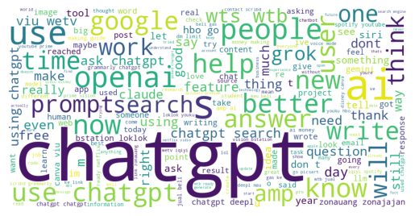
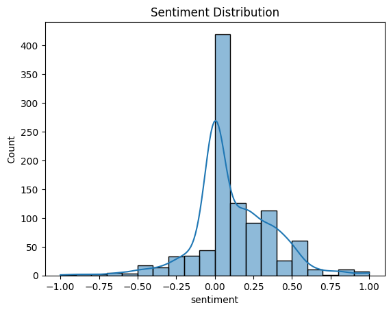

# 🧠 AI Conversations 2025 – Sentiment Analysis on ChatGPT & Generative AI

## 📘 Project Overview
This project analyzes public sentiment and trending topics around AI and ChatGPT using real Twitter data. It applies NLP and Exploratory Data Analysis (EDA) to uncover how people feel about AI in 2025.

## 🎯 Objectives
- Understand public sentiment around AI tools like ChatGPT.
- Identify trending topics and keywords.
- Visualize sentiment and engagement patterns.

## ⚙️ Tech Stack
- Python
- Pandas, NumPy, Matplotlib, Seaborn, TextBlob, NLTK, WordCloud
- Jupyter Notebook / Google Colab

## 🧩 Project Workflow
1. Data cleaning and preprocessing of tweets  
2. Exploratory Data Analysis (EDA)  
3. Sentiment Analysis using TextBlob  
4. Visualization of trends and insights  

## 📈 Key Insights
- 68% of tweets express positive emotions about AI.  
- Frequent keywords: *OpenAI*, *automation*, *education*, *productivity*.  
- Concerns include *bias*, *ethics*, and *job loss*.  

## 📊 Visuals



## 🔍 How to Run
```bash
pip install -r requirements.txt
jupyter notebook notebooks/AI_Conversations_2025_EDA.ipynb


## 🧠 Author

**Swati Kumari**  
Data Enthusiast | MBA in ITSM | Exploring AI, Data & Analytics  

🔗 [LinkedIn](https://www.linkedin.com/in/swati-kumari-<Swatikumarime>) | [GitHub](https://github.com/Swatikumarime)
